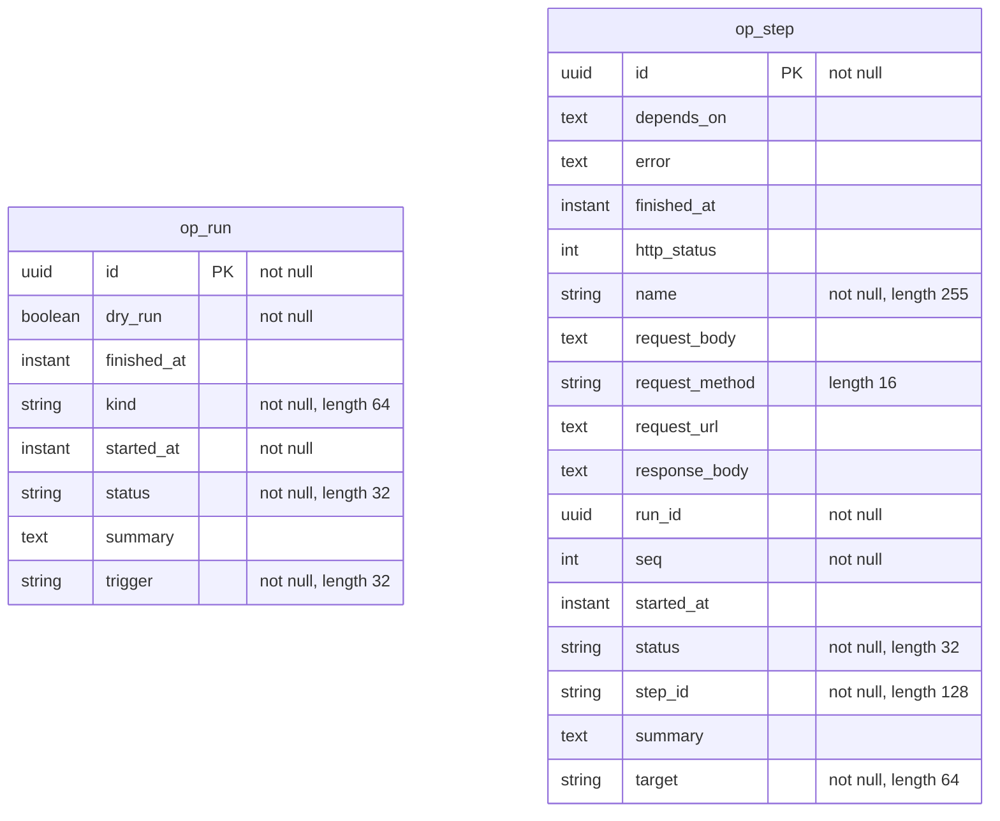

<!-- Generated by `qits database diagram` (jpa). Do not edit: the entity-diagram automation rewrites this file on every release request fold. -->
# Persistence unit `orchestrator`

Datasource `orchestrator` · package `eu.wohlben.qits.orchestrator.entity` · 2 entities

